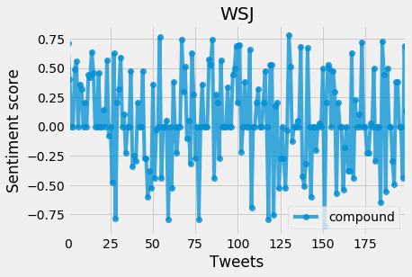
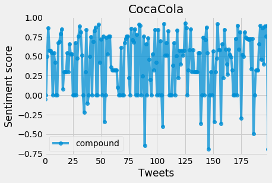

# Twitter Bot - Sentiment Analysis

## Overview
This project involves a Twitter Bot that performs sentiment analysis on tweets. The bot listens for requests on Twitter and posts back an image of the analysis to the user who requested it.
## Dependencies
The project uses the following libraries:
- `tweepy` for interacting with the Twitter API
- `json` for handling JSON data
- `pandas` and `numpy` for data manipulation
- `matplotlib` for plotting sentiment analysis results
- `datetime` for handling date and time
- `os` for environment variable management
- `time` for managing intervals between bot actions
- `vaderSentiment` for sentiment analysis

## Functionality
### API Authentication
The bot uses Twitter API keys (consumer key, consumer secret, access token, and access token secret) to authenticate and interact with Twitter.

### Parsing Requests
When the bot receives a mention, it identifies and parses the tweet to extract the screen names of users for whom sentiment analysis is requested.

### Analyzing Sentiments
The bot cleanses the tweets to remove noise (like mentions, URLs, and media links) and uses the VADER sentiment analysis tool to analyze the sentiment of each tweet. The analysis results include a compound score indicating the overall sentiment.

### Plotting Sentiments
The bot plots the sentiment scores using `matplotlib`. It generates a line plot with sentiment scores for each tweet, where positive sentiments are marked in green and negative sentiments in red.

### Handling Requests
The bot continuously scans for new mentions on Twitter. When it finds a mention, it processes the request by performing sentiment analysis on the recent tweets of the requested users. It then posts the sentiment analysis results back to the user who requested it, along with an image of the plot.

### Running the Bot
The bot runs in an infinite loop, periodically scanning for new requests and processing them.

## Example Outputs
The bot provides sentiment analysis for users like WSJ and CocaCola, displaying the number of tweets analyzed and the resulting sentiment plots.

- WSJ - 200 Tweets Analyzed
  

- CocaCola - 200 Tweets Analyzed
  
